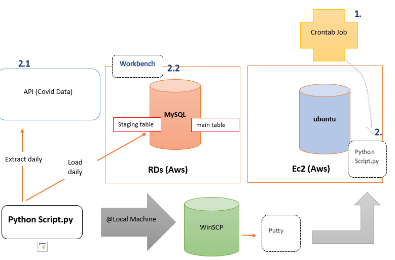

# ETL Project: From Scratch to Data Warehouse 

Aim: Setup an ETL Job to Extract daily covid data from API for Data Team, who are going to use data to create insight and dashboards. 

Result: Automated (crontab) job has been setup on EC2 (Aws) to run a python script daily to extract, transform and load data on to SQL Table.

# Code and Resources Used
Python Version: 3.7

Packages: pandas,json,mysql,requests,pymsql,sqlalchemy and datetime.

AWs: RDs (Mysql) and EC2 (ubuntu)

API: covid19api.com 

# Project Process

### [Python Script](https://github.com/Jaspreetsm21/ETL_Project/blob/main/Daily_script.py)

Inside the script, it follows the steps in the screenshot below:
- Request Api and Transform
- Connect with Mysql and load the data

 
### Schedule Jobs

Scheduling Python Script at 11am using Crontab on Ec2 ( Linux)

### Mysql (Workbench) and Covid Data

### Learning in the Project

I was having a problem connecting jupiter (python) with Mysql credential.Since, I was locally trying to connect with Mysql. I need to grant the privileges and create a new password :

CREATE USER 'Username'@'ip' IDENTIFIED WITH mysql_native_password BY 'new password';

or 

alter user 'JasDB'@'ip' identified by 'password'

-- Grant user permissions to all tables in my_database from localhost 

GRANT ALL ON Jas_Schema.* TO 'Username'@'ip'

-- Grant user permissions to my_table in my_database from localhost 

GRANT ALL ON Jas_Schema.dual_table TO 'Username'@'ip';

-- Grant user permissions to all tables and databases from all hosts

GRANT ALL PRIVILEGES ON Jas_Schema.* TO 'Username'@'ip' WITH GRANT OPTION;

#Check the user privilegs
select user, host from mysql.user;

